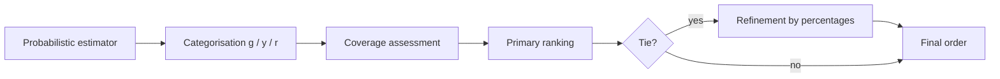

# **RAG & AI Systems — Robust Framework for Noisy, Incomplete, and Heterogeneous Signals | Production-Proven Multi-Criteria Ranking**

---

 **Reliable Multi-Criteria Ranking Under Uncertainty (RMC-Rank)** is a framework I developed and deployed in production for real-world AI and RAG pipelines.

 It provides a **domain-independent, two-stage ranking mechanism** for structured evaluation tasks with noisy, incomplete, and heterogeneous signals.

 **Key features:**

 * **Categorical layer (robust layer):** resistant to noise, enforces structural compliance.
 * **Continuous layer (tie-breaking layer):** leverages confidence magnitudes to resolve ties.
 * **Piecewise functional formulation:** enables formal reasoning, guarantees monotonicity, boundedness, and interpretable scoring.

 This production-grade mechanism is **generalized into a formal, reproducible formula** applicable to any multi-signal evaluation scenario — from candidate ranking to RAG component scoring.

---

## Table of Contents

- [Brief idea](#brief-idea)
- [Notation](#notation)
  - [Confidence categories](#confidence-categories)
- [Coverage assessment](#coverage-assessment)
  - [Mandatory (quadratic penalty for incompleteness)](#mandatory-quadratic-penalty-for-incompleteness)
  - [Preferred and Tasks (linear aggregation)](#preferred-and-tasks-linear-aggregation)
- [Block weights](#block-weights)
  - [Strategy modes](#strategy-modes)
- [Phase 1 — ranking by categories](#phase-1--ranking-by-categories)
- [Phase 2 — refinement by percentages (tie-breaking)](#phase-2--refinement-by-percentages-tie-breaking)
- [Boundary conditions](#boundary-conditions)
- [Contribution of categories](#contribution-of-categories)
- [Pipeline visualization](#pipeline-visualization)
- [Coverage sensitivity](#coverage-sensitivity)
- [Example (Mandatory)](#example-mandatory)
- [Why categories matter more than average percentages](#why-categories-matter-more-than-average-percentages)
- [Rationale for coefficients](#rationale-for-coefficients)
- [Design principles](#design-principles)
- [Theoretical interpretation](#theoretical-interpretation)
- [Areas of application](#areas-of-application)

---

## Brief idea

* First, **structural completeness of compliance** is assessed (how many requirements are covered and how).
* Then, in case of a tie, **depth of confidence** within categories is taken into account.
* Base requirements dominate; additional ones accumulate advantage.

---

## Notation

For each block of criteria

$$
B \in {\text{Mandatory}, \text{Preferred}, \text{Tasks}}
$$

| Symbol | Meaning |
| ------ | -------- |
| $$N$$  | number of criteria in the block |
| $$g$$  | number of **green** matches (high confidence) |
| $$y$$  | number of **yellow** matches (partial compliance) |
| $$r$$  | number of **red** matches (weak/absent compliance) |

### Confidence categories

| Category | Notation | Range | Interpretation |
| -------- | -------- | ----- | -------------- |
| High     | $$g$$    | $$\ge 0.70$$         | Strong compliance |
| Partial  | $$y$$    | $$0.30\text{–}0.69$$ | Incomplete compliance |
| Low      | $$r$$    | $$< 0.30$$           | Weak/no compliance |

---

## Coverage assessment

### Mandatory (quadratic penalty for incompleteness)

$$
\text{ColorScore}_B=
\frac{(g + 0.5,y),(g + y) + 0.01,r}{N^2}
$$

**Properties**

* nonlinearly penalises gaps in base criteria;
* strengthens the effect of **structural completeness**;
* sharply reduces the score when mandatory items are missing.

---

### Preferred and Tasks (linear aggregation)

$$
\text{ColorScore}_B=
\frac{g + 0.5,y + 0.01,r}{N}
$$

**Properties**

* accumulates supporting signals;
* weak penalty for absence;
* stabilises ranking and does not turn "preferred" into a filter.

---

## Block weights

Base configuration:

| Block     | Weight   |
| --------- | -------- |
| Mandatory | $$1.0$$  |
| Preferred | $$0.1$$  |
| Tasks     | $$0.1$$  |

### Strategy modes

| Mode            | Weights (Mand, Pref, Tasks) | Interpretation |
| --------------- | --------------------------- | -------------- |
| **Strict filter** | $$(1.0,;0.1,;0.1)$$        | Base requirements dominate; additional ones do not compensate for gaps |
| **Flexible profile** | $$(0.6,;0.2,;0.2)$$     | Broad profile can outweigh base shortfall |
| **Balance**      | $$(0.7,;0.15,;0.15)$$    | Compromise: base matters, but boosters matter too |

> Weights are **decision policy**, not a property of the data.

---

## Phase 1 — ranking by categories

Main score (used for primary sorting):

$$
\text{FinalColorScore}=
w_m,\text{ColorScore}*{Mand}
+
w_p,\text{ColorScore}*{Pref}
+
w_t,\text{ColorScore}_{Tasks}
$$

**Interpretation**

* **coverage** and **structure** are taken into account;
* the "many preferred" effect is dampened by normalisation over $$N$$;
* mandatory criteria dominate by weight.

---

## Phase 2 — refinement by percentages (tie-breaking)

Applied **only** when primary scores are equal within $$\varepsilon$$ (e.g. $$10^{-6}$$) or when there are no $$g$$ and $$y$$ in any block.

For each block we compute mean percentages:

| Notation | Meaning |
| -------- | ------- |
| $$G$$    | mean percentage over greens |
| $$Y$$    | mean percentage over yellows |
| $$R$$    | mean percentage over reds |

Normalisation:

$$
G_n=\frac{G}{100},\quad
Y_n=\frac{Y}{100},\quad
R_n=\frac{R}{100}
$$

Refined block score:

$$
\text{PercentScore}_B=
\bigl(G_n + 0.5,Y_n + 0.01,R_n\bigr)\cdot \text{ColorScore}_B
$$

Final:

$$
\text{FinalPercentScore}=
w_m,\text{PercentScore}*{Mand}
+
w_p,\text{PercentScore}*{Pref}
+
w_t,\text{PercentScore}_{Tasks}
$$

Sorting is by $$\text{FinalPercentScore}$$.

---

## Boundary conditions

* If a block has no $$g$$ and no $$y$$ → block score $$=0$$.
* If $$N=0$$ → the weight of the empty block is redistributed among the remaining blocks.
* If all blocks yield $$0$$ in Phase 1 → Phase 2 is used for a deterministic order.

---

## Contribution of categories

| Category | Weight in coverage | Role |
| -------- | ------------------ | ---- |
| $$g$$    | $$1.0$$            | main signal |
| $$y$$    | $$0.5$$            | partial confirmation |
| $$r$$    | $$0.01$$           | weak differentiator |

---

## Pipeline visualization

---

## Coverage sensitivity

---

## Example (Mandatory)

| $$g$$ | $$y$$ | $$r$$ | $$N$$ | $$\text{ColorScore}$$ |
| ----- | ----- | ----- | ----- | --------------------- |
| 8     | 1     | 1     | 10    | 0.65                  |
| 7     | 2     | 1     | 10    | 0.57                  |
| 6     | 3     | 1     | 10    | 0.49                  |

---

## Why categories matter more than average percentages

**Problem with averages:**

* sensitive to outliers;
* mask failures on individual requirements;
* favour "mediocre" cases when there are critical gaps;
* confidence values are often noisy.

**Approach:** first **discrete classification** (robustness), then **continuous refinement** (resolving ties).

**Consequences:**

* a failure on a requirement cannot be hidden by a high average;
* the impact of assessor subjectivity is reduced;
* interpretability is improved.

---

## Rationale for coefficients

**Why $$0.5$$ for partial match?**  
Reflects reality: partial compliance is meaningful but not equal to full; it ensures smooth rank transitions.

**Why $$0.01$$ for low confidence?**  
Preserves a deterministic order even when there are no matches, without materially affecting coverage.

**Why normalisation by $$N$$?**  
Prevents inflation from long criterion lists and makes block contributions comparable.

---

## Design principles

* **Robustness to Noise** — discretisation stabilises ranking.
* **Structural First** — structure completeness first, then confidence magnitude.
* **Hierarchical Importance** — base criteria dominate via weights and the quadratic form.
* **Controlled Continuity** — partial matches provide smoothness.
* **Interpretability** — the result decomposes into coverage, confidence, and weights.

---

## Formal Definition

The ranking function is formally defined as a **piecewise functional**:

$$
\text{Score}(x) =
\begin{cases}
f_\text{Mandatory}(x_\text{Mand}) + f_\text{Preferred}(x_\text{Pref}) + f_\text{Tasks}(x_\text{Tasks}), & \text{if } N_B>0 \\
0, & \text{if all blocks empty or zero coverage}
\end{cases}
$$

where $f_B$ is the ColorScore function for block $B$.

### Lexicographic Relation

Mandatory criteria dominate over Preferred and Tasks. The ranking follows a lexicographic ordering:

$$
\text{Score}_1 > \text{Score}_2 \quad \text{if} \quad
f_\text{Mandatory}(x_1) > f_\text{Mandatory}(x_2) \quad \text{or tie-breaking by } f_\text{Preferred}, f_\text{Tasks}.
$$

This formalizes the tie-breaking mechanism: categorical robustness first, continuous refinement second.

### Monotonicity Property

For each category block, the scoring function is monotonic:

$$
g \uparrow \implies f_B \uparrow, \quad y \uparrow \implies f_B \text{ non-decreasing}
$$

This transforms the intuitive idea into a **formal property of the ranking function**.

---

## Formal Properties

The following properties establish the theoretical foundation of the ranking model:

### Property 1: Monotonicity with respect to $g$

> Increasing the number of high-confidence matches $g$ never decreases the block score.

$$
g_1 > g_2 \implies f_B(g_1, y, r) \ge f_B(g_2, y, r)
$$

### Property 2: Mandatory Dominance

> If Preferred and Tasks are fixed, more Mandatory coverage implies a higher final score:

$$
f_\text{Final}(Mand_1, Pref, Tasks) > f_\text{Final}(Mand_2, Pref, Tasks) \quad \text{if } Mand_1 > Mand_2
$$

### Property 3: Boundedness

> ColorScore and PercentScore are always in the range $[0,1]$:

$$
0 \le f_B \le 1
$$

### Property 4: Scale Invariance with respect to $N$

> Normalization by $N$ ensures that long criterion lists do not inflate the score:

$$
f_B(g, y, r, N) \text{ is normalized by } N
$$

### Property 5: Tie-breaking Correctness

> If all blocks are equal in Phase 1, Phase 2 deterministically establishes an order without violating monotonicity.

---

## Relation to Existing Approaches

- **Weighted sum models:** Standard linear aggregation without separation of coverage and confidence.
- **Threshold filtering:** Filters candidates by basic requirements but loses nuance in partial coverage.
- **Lexicographic ranking:** Similar in spirit to Mandatory-first approach but often lacks continuous tie-breaking.
- **Multi-objective scoring:** Aggregates multiple objectives but rarely performs structural categorization.

**Our approach differs by:**

1. Explicit separation of coverage and confidence.
2. Quadratic penalty for missing mandatory criteria.
3. Two-stage ranking: categorical robustness first, continuous refinement second.
4. Interpretable scoring with explicit category weights.

---

## Areas of application

* ranking of search results
* model and configuration selection
* evaluation of systems by multiple signals
* aggregation of expert judgements
* evaluation of components in RAG pipelines

---

---

# Надёжное многокритериальное ранжирование при неопределённости

Предметно-независимый фреймворк ранжирования для задач структурированной оценки, где сигналы **шумные**, **неполные** и **разнородные**.

Модель **разделяет покрытие и уверенность** и выполняет ранжирование в два этапа:

1. **Категориальный слой (robust layer)** — устойчив к шуму и отвечает за структуру соответствия.
2. **Непрерывный слой (tie-breaking layer)** — использует величины уверенности только для разрешения равенств.

---

## Краткая идея

* Сначала оценивается **структурная полнота соответствия** (сколько требований покрыто и как).
* Затем, при равенстве, учитывается **глубина уверенности** внутри категорий.
* Базовые требования доминируют, дополнительные — накапливают преимущество.

---

## Обозначения

Для каждого блока критериев

$$
B \in {\text{Mandatory}, \text{Preferred}, \text{Tasks}}
$$

| Символ | Смысл                                                            |
| ------ | ---------------------------------------------------------------- |
| $$N$$  | число критериев в блоке                                          |
| $$g$$  | число **зелёных** совпадений (высокая уверенность)               |
| $$y$$  | число **жёлтых** совпадений (частичное соответствие)             |
| $$r$$  | число **красных** совпадений (слабое/отсутствующее соответствие) |

### Категории уверенности

| Категория | Обозначение | Диапазон             | Интерпретация           |
| --------- | ----------- | -------------------- | ----------------------- |
| Высокая   | $$g$$       | $$\ge 0.70$$         | Сильное соответствие    |
| Частичная | $$y$$       | $$0.30\text{–}0.69$$ | Неполное соответствие   |
| Низкая    | $$r$$       | $$< 0.30$$           | Слабое/нет соответствия |

---

## Оценка покрытия (Coverage)

### Mandatory (квадратичный штраф за неполноту)

$$
\text{ColorScore}_B=
\frac{(g + 0.5,y),(g + y) + 0.01,r}{N^2}
$$

**Свойства**

* нелинейно штрафует пропуски базовых критериев;
* усиливает влияние **структурной полноты**;
* резко снижает скор при выпадении обязательных пунктов.

---

### Preferred и Tasks (линейная агрегация)

$$
\text{ColorScore}_B=
\frac{g + 0.5,y + 0.01,r}{N}
$$

**Свойства**

* аккумулирует поддерживающие сигналы;
* слабый штраф за отсутствие;
* стабилизирует ранжирование и не превращает «желательные» в фильтр.

---

## Веса блоков

Базовая конфигурация:

| Блок      | Вес     |
| --------- | ------- |
| Mandatory | $$1.0$$ |
| Preferred | $$0.1$$ |
| Tasks     | $$0.1$$ |

### Режимы стратегии

| Режим              | Веса (Mand, Pref, Tasks) | Интерпретация                                                         |
| ------------------ | ------------------------ | --------------------------------------------------------------------- |
| **Жёсткий фильтр** | $$(1.0,;0.1,;0.1)$$      | Базовые требования доминируют; дополнительные не компенсируют пробелы |
| **Гибкий профиль** | $$(0.6,;0.2,;0.2)$$      | Широкий профиль может перекрыть недостачу по базе                     |
| **Баланс**         | $$(0.7,;0.15,;0.15)$$    | Компромисс: база важна, но усилители значимы                          |

> Веса — это **политика принятия решений**, а не свойство данных.

---

## Фаза 1 — ранжирование по категориям

Основной скор (используется для первичной сортировки):

$$
\text{FinalColorScore}=
w_m,\text{ColorScore}*{Mand}
+
w_p,\text{ColorScore}*{Pref}
+
w_t,\text{ColorScore}_{Tasks}
$$

**Интерпретация**

* учитывается **покрытие** и **структура**;
* эффект «много желательных» подавляется нормализацией по $$N$$;
* обязательные критерии доминируют весом.

---

## Фаза 2 — уточнение по процентам (tie-breaking)

Применяется **только** если первичные скоры равны с точностью $$\varepsilon$$ (например, $$10^{-6}$$) или когда во всех блоках нет $$g$$ и $$y$$.

Для каждого блока считаем средние проценты:

| Обозначение | Смысл                      |
| ----------- | -------------------------- |
| $$G$$       | средний процент по зелёным |
| $$Y$$       | средний процент по жёлтым  |
| $$R$$       | средний процент по красным |

Нормализация:

$$
G_n=\frac{G}{100},\quad
Y_n=\frac{Y}{100},\quad
R_n=\frac{R}{100}
$$

Уточнённый скор блока:

$$
\text{PercentScore}_B=
\bigl(G_n + 0.5,Y_n + 0.01,R_n\bigr)\cdot \text{ColorScore}_B
$$

Итог:

$$
\text{FinalPercentScore}=
w_m,\text{PercentScore}*{Mand}
+
w_p,\text{PercentScore}*{Pref}
+
w_t,\text{PercentScore}_{Tasks}
$$

Сортировка выполняется по $$\text{FinalPercentScore}$$.

---

## Граничные условия

* Если в блоке нет $$g$$ и $$y$$ → скор блока $$=0$$.
* Если $$N=0$$ → вес пустого блока перераспределяется между оставшимися.
* Если все блоки дают $$0$$ на Фазе 1 → используется Фаза 2 для детерминированного порядка.

---

## Вклад категорий

| Категория | Вес в покрытии | Роль                    |
| --------- | -------------- | ----------------------- |
| $$g$$     | $$1.0$$        | основной сигнал         |
| $$y$$     | $$0.5$$        | частичное подтверждение |
| $$r$$     | $$0.01$$       | слабый дифференциатор   |

---

## Визуализация конвейера

---

## Чувствительность покрытия

---

## Пример (Mandatory)

| $$g$$ | $$y$$ | $$r$$ | $$N$$ | $$\text{ColorScore}$$ |
| ----- | ----- | ----- | ----- | --------------------- |
| 8     | 1     | 1     | 10    | 0.65                  |
| 7     | 2     | 1     | 10    | 0.57                  |
| 6     | 3     | 1     | 10    | 0.49                  |

---

## Почему категории важнее средних процентов

**Проблема средних:**

* чувствительны к выбросам;
* маскируют провалы по отдельным требованиям;
* поощряют «средненьких» при наличии критических пробелов;
* величины уверенности часто шумные.

**Решение:** сначала **дискретная классификация** (устойчивость), затем — **непрерывное уточнение** (разрешение равенств).

**Следствия:**

* провал по требованию нельзя скрыть высоким средним;
* уменьшается влияние субъективности оценщика;
* повышается интерпретируемость.

---

## Обоснование коэффициентов

**Почему $$0.5$$ для частичного совпадения?**
Отражает реальность: частичное соответствие — значимо, но не равно полному; обеспечивает плавные переходы ранга.

**Почему $$0.01$$ для низкой уверенности?**
Сохраняет детерминированный порядок даже при отсутствии совпадений, не влияя существенно на покрытие.

**Почему нормализация по $$N$$?**
Предотвращает инфляцию длинных списков критериев и делает вклад блоков сопоставимым.

---

## Принципы дизайна

* **Robustness to Noise** — дискретизация стабилизирует ранжирование.
* **Structural First** — сначала полнота структуры, затем величина уверенности.
* **Hierarchical Importance** — базовые критерии доминируют через веса и квадратичную форму.
* **Controlled Continuity** — частичные совпадения обеспечивают гладкость.
* **Interpretability** — итог раскладывается на покрытие, уверенность и веса.

---

## Формальное определение

Функция ранжирования формально определена как **кусочно-заданный функционал**:

$$
\text{Score}(x) =
\begin{cases}
f_\text{Mandatory}(x_\text{Mand}) + f_\text{Preferred}(x_\text{Pref}) + f_\text{Tasks}(x_\text{Tasks}), & \text{если } N_B>0 \\
0, & \text{если все блоки пусты или покрытие равно нулю}
\end{cases}
$$

где $f_B$ — функция ColorScore для блока $B$.

### Лексикографическое отношение

Критерии Mandatory доминируют над Preferred и Tasks. Ранжирование следует лексикографическому порядку:

$$
\text{Score}_1 > \text{Score}_2 \quad \text{тогда и только тогда, когда} \quad
f_\text{Mandatory}(x_1) > f_\text{Mandatory}(x_2) \quad \text{или разрешение равенства через } f_\text{Preferred}, f_\text{Tasks}.
$$

Это формализует механизм разрешения равенств: сначала категориальная устойчивость, затем непрерывное уточнение.

### Свойство монотонности

Для каждого блока категорий функция скоринга монотонна:

$$
g \uparrow \implies f_B \uparrow, \quad y \uparrow \implies f_B \text{ не убывает}
$$

Это превращает интуитивную идею в **формальное свойство функции ранжирования**.

---

## Формальные свойства

Следующие свойства устанавливают теоретический фундамент модели ранжирования:

### Свойство 1: Монотонность по $g$

> Увеличение числа высокоуверенных совпадений $g$ никогда не уменьшает скор блока.

$$
g_1 > g_2 \implies f_B(g_1, y, r) \ge f_B(g_2, y, r)
$$

### Свойство 2: Доминирование Mandatory

> Если Preferred и Tasks фиксированы, большее покрытие Mandatory влечёт больший итоговый скор:

$$
f_\text{Final}(Mand_1, Pref, Tasks) > f_\text{Final}(Mand_2, Pref, Tasks) \quad \text{если } Mand_1 > Mand_2
$$

### Свойство 3: Ограниченность

> ColorScore и PercentScore всегда в диапазоне $[0,1]$:

$$
0 \le f_B \le 1
$$

### Свойство 4: Устойчивость к масштабированию $N$

> Нормализация по $N$ обеспечивает, что длинные списки критериев не раздувают скор:

$$
f_B(g, y, r, N) \text{ нормализован на } N
$$

### Свойство 5: Корректность разрешения равенств

> Если все блоки равны на Фазе 1, Фаза 2 детерминированно устанавливает порядок без нарушения монотонности.

---

## Связь с существующими подходами

- **Модели взвешенной суммы:** Стандартная линейная агрегация без разделения покрытия и уверенности.
- **Пороговая фильтрация:** Фильтрует кандидатов по базовым требованиям, но теряет нюансы в частичном покрытии.
- **Лексикографическое ранжирование:** Похоже по идее на подход Mandatory-first, но часто не учитывает непрерывное разрешение равенств.
- **Многокритериальный скоринг:** Агрегирует несколько целей, но редко выполняет структурную категоризацию.

**Наш подход отличается тем, что:**

1. Явно разделяет покрытие и уверенность.
2. Применяет квадратичный штраф за пропуск обязательных критериев.
3. Использует двухэтапное ранжирование: сначала категориальная устойчивость, затем непрерывное уточнение.
4. Обеспечивает интерпретируемый скоринг с явными весами категорий.

---

## Области применения

* ранжирование результатов поиска
* выбор моделей и конфигураций
* оценка систем по множеству сигналов
* агрегирование экспертных суждений
* оценка компонентов в RAG-конвейерах
